#  Financas.AI

## This is a financial education tool developed during the _Santander 2026 - AI React Front-end_ bootcamp at [DIO.me](https://dio.me)

### This tool uses generative AI to help users improve their financial well-being and achieve their future goals.

Here are some features of the App.

- ✅ - Collects user financial data and future goal details to model personalized planning.
- 📈 - Simulates whether current income supports the goal within the target timeframe and highlights shortfalls.
- ✨ - Generates AI-driven financial health feedback and practical improvement tips.
- 💾 - Stores simulations locally in browser localStorage for later review; database persistence requires additional implementation.
- 🚮 - History entries can be deleted.
- 💬 - Enables follow-up conversations with an AI chat to explore simulation results and request extra guidance.

## 📱 Responsive Design

The application was built with responsiveness in mind, providing a seamless experience across desktops, tablets, and mobile devices.

---

## 🛠️ Technologies Used

### ⚛️ React

### 📘 TypeScript

### 🟨 JavaScript

### 🌐 HTML5

### 🎨 Tailwind CSS

### 🟩 Node.js

---

## 📦 Installation

Clone the repository:

```bash
git clone <repository-url>
```

Navigate to the project directory:

```bash
cd project-name
```

Install the dependencies:

```bash
npm install
```

Start the development server:

```bash
npm run dev
```

---

### The app supports both Light and Dark modes, as shown in the images below.

<table>
- Home page
  <tr>
    <td>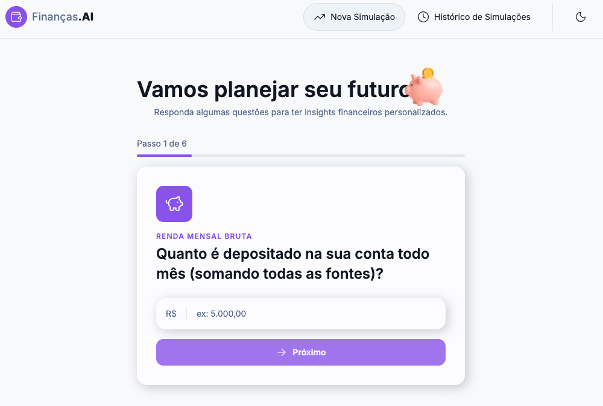</td>
    <td>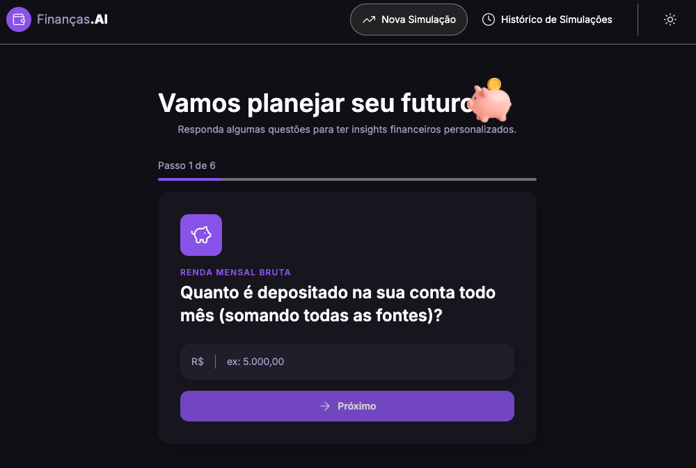</td>
  </tr>
</table>

<table>
- Simulation page
  <tr>
    <td>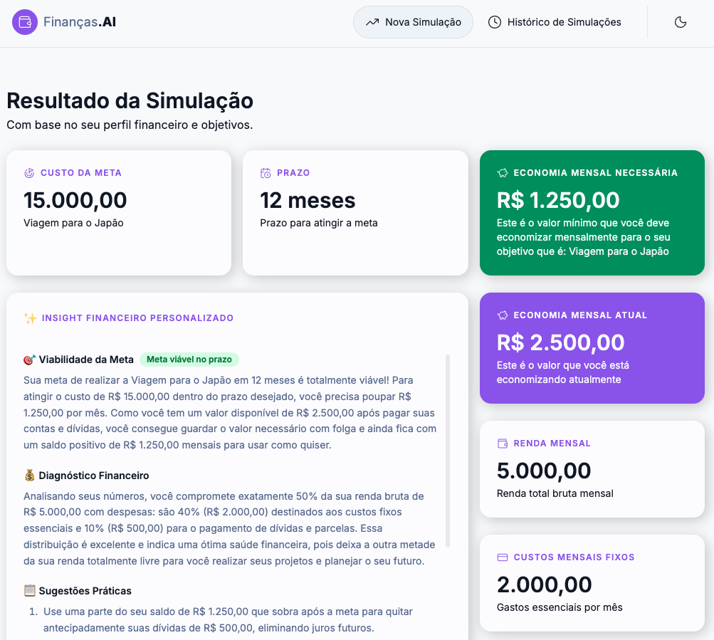</td>
    <td>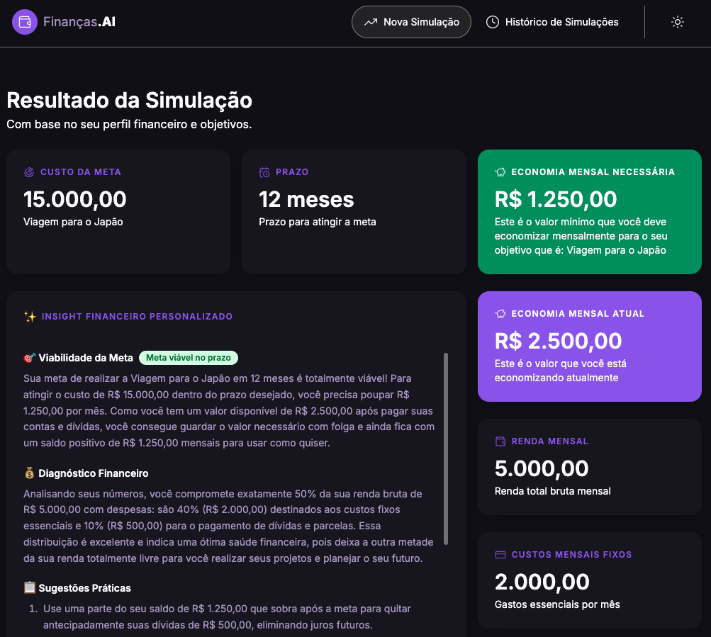</td>
  </tr>
</table>

<table>
- History page
  <tr>
    <td>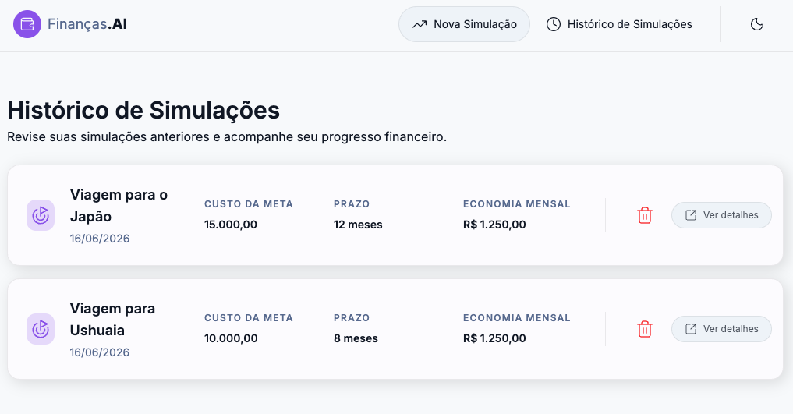</td>
    <td>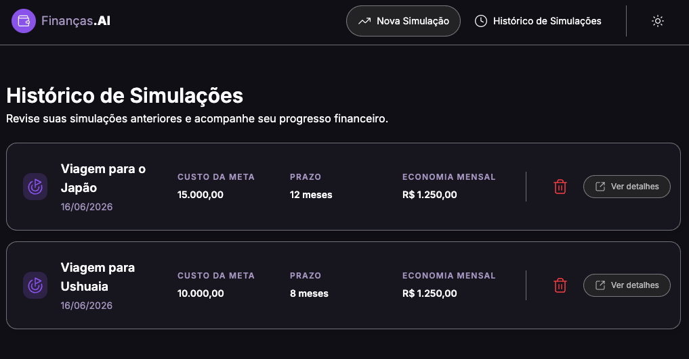</td>
  </tr>
</table>

<table>
- AI chat page
  <tr>
    <td>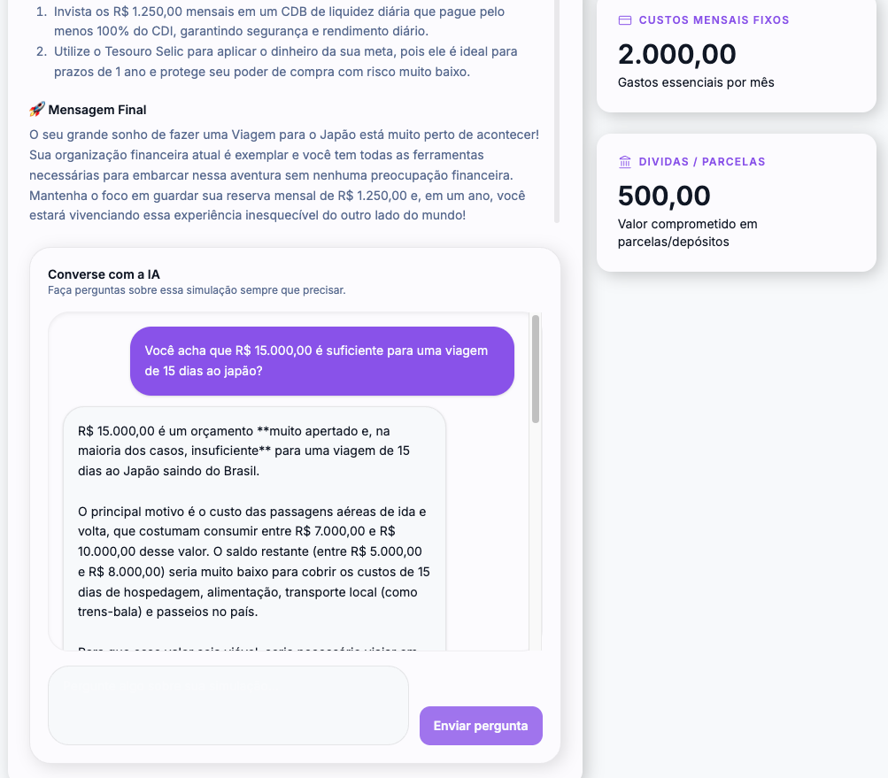</td>
    <td>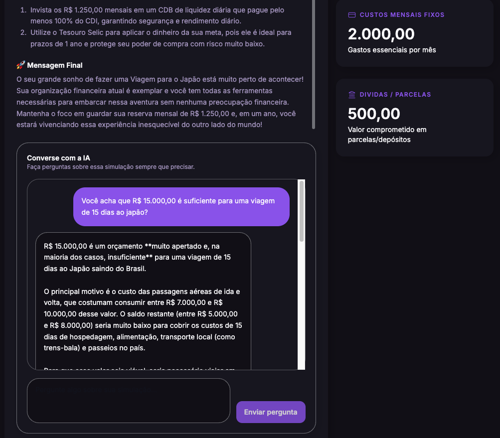</td>
  </tr>
</table>

---

### The app is also responsive.

<table>
  <tr>
    <th colspan="2">- Home page</th>
    <th colspan="2">- Simulation page</th>
  </tr>
  <tr>
  <td></td>
  <td></td>
  <td>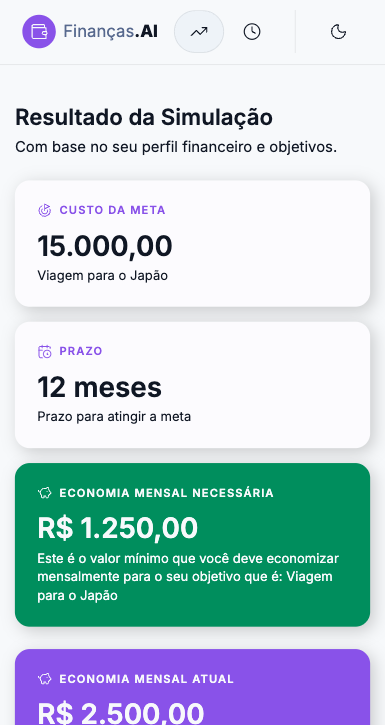</td>
  <td>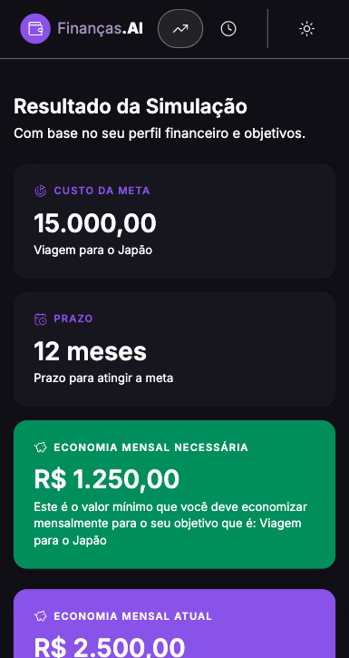</td>
  </tr>

  <tr>
    <th colspan="4"></th>
  </tr>
  <tr>
    <th colspan="2">- History page</th>
    <th colspan="2">- AI chat page</th>
  </tr>
  <tr>
  <td>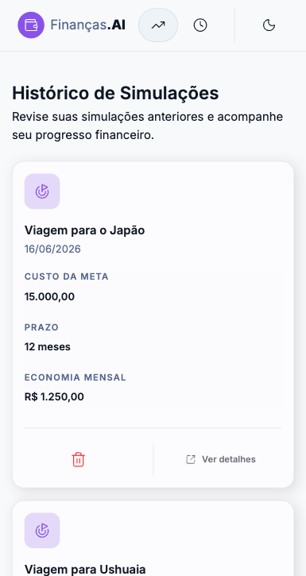</td>
  <td>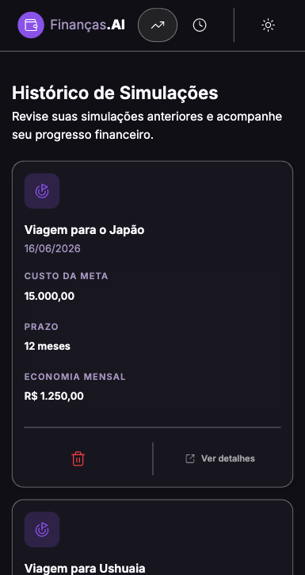</td>
  <td>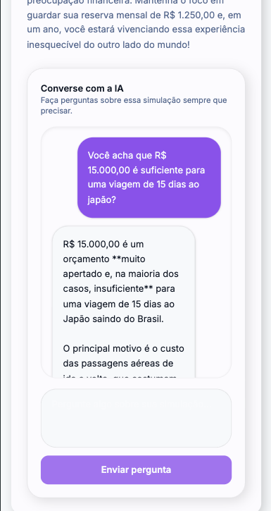</td>
  <td>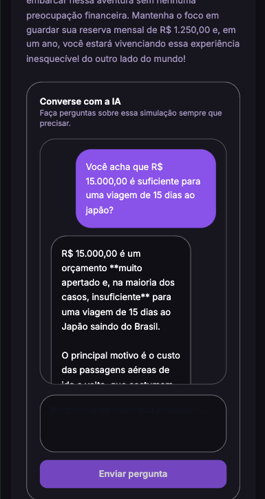</td>
  </tr>
</table>
